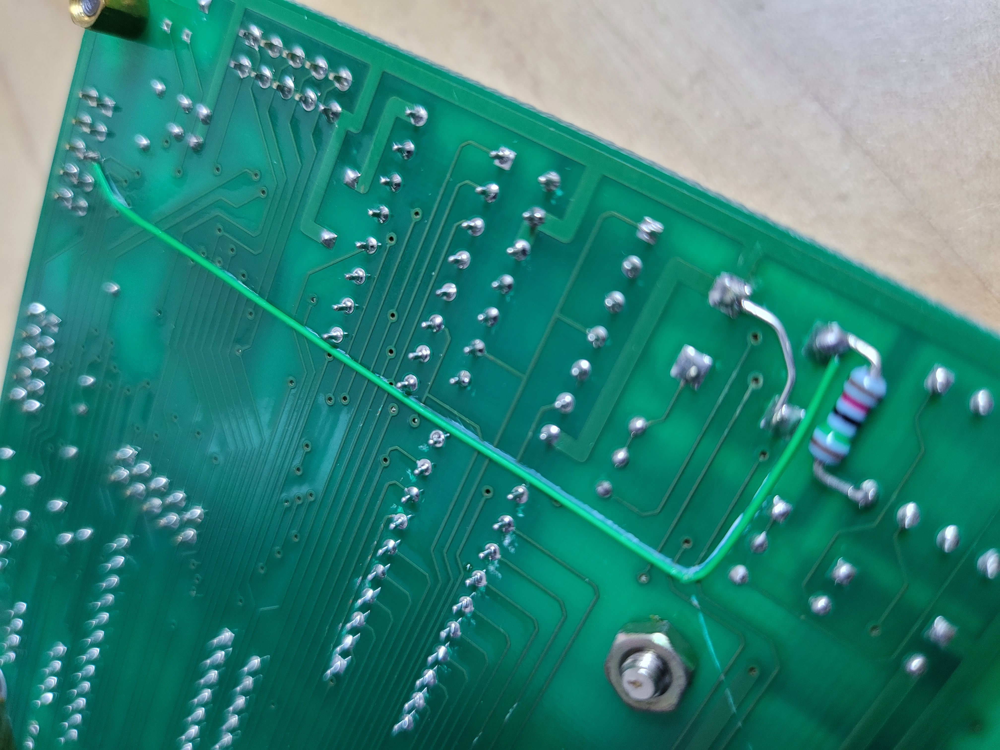

# AVR ATmega128 마스터
* https://www.yes24.com/Product/Goods/1480788
* gcc-avr (5.4.0) + avr-libc (2.0.0) on Linux Box
* 리펙토링 된 코드는 원작자의 의도와 다를 수 있음. (원작자에게 문의 금지)

## TOOL 설치
```bash
sudo apt install gcc-avr avr-libc avrdude
```

## 한글 코드 관련 잡설
* **AVR ATmega128 마스터** : *조합형* 한글 인코딩
* **AVR ATmega128 정복** : *완성형* 한글 인코딩 (더 이후에 나온 **AT91SAM7S256으로 시작하기** 책의 내용이 *조합형* 기준인 걸 봤을 때, 출판 이후 개정된 듯...)
  * 여담으로 **AVR ATmega128 정복** 의 예제들 중 일부는, **OK-128 V2.2**에서 실습해 보려면, 보드 개조가 필요하다.<br>(RESET SW를 제거하고, 2-PIN Tact SW를 2개 실장 후, 하나는 기존과 같이 RESET으로, 다른 하나는 <code>PE7</code> 와 10KOhm 저항을 연결해야 함. 저~ 아래 보드 개조 사진 참고.)
* Linux에서는 *조합형*과 *완성형* 모두 쓰기 불편하므로 (매번 <code>iconv -f UTF-8 -t JOHAB</code>...), 아예 *UTF-8*을 *조합형* 으로 변환하는 코드를 구현해 넣었다.
  * 대신 *완성형* 관련 코드는 완전히 삭제.
  * 바이너리 크기 작아지는 건 덤.
  * *완성형*으로는 표시할 수 없는 아래와 같은 문자열도 잘 표시해 준다.

```c
    GLCD_string(2, 0, 0, "뷁 되뇄다 설렜다");
```

## 보드 개조



* 이밖에 원저자가 기겁할 만한 개조도 있는데... 지면 관계상 생략...
